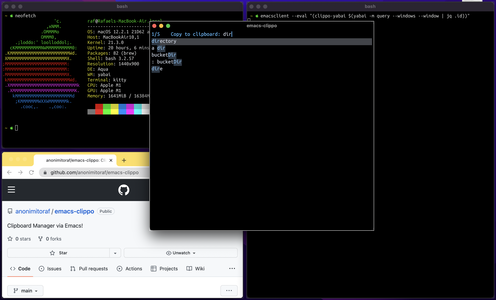

# Supported Window Managers
- yabai

**Feel free to implement/contact me for other window managers!**

# Demos


# Installation
Not in MELPA (yet) but, all it you really need to do is evaluate `clippo.el` in your Emacs

# Quick Start
The set up required depends on your window manager

## Yabai

### Prerequisites
- yabai
- jq
- emacs (with a daemon currently running)

### Setup

- Tell yabai to auto-focus emacs-clip when it gets instantiated. Put this into your yabairc
```shell
yabai -m signal --add event=window_created title='^emacs-clippo.*' action='yabai -m window --focus ${YABAI_WINDOW_ID}'
```

- Tell yabai configure emacs-clip to be a floating window. Put this into your yabairc
``` shell
yabai -m rule --add title='^emacs-clippo.*' layer=above manage=off
```

If you built Emacs with `--with-no-frame-refocus`, the command you want to invoke is:
``` shell
emacsclient --eval "(clippo)"
```

Otherwise:
``` shell
emacsclient --eval "(clippo-yabai $(yabai -m query --windows --window | jq .id))"
```
We need to pass in the window ID, otherwise, OSX focuses Emacs GUI (from which emacsclient was spawned) after you copy to clipboard.
NOTE: This, for some reason, causes a 1-2 sec delay for emacsclient to close, so it's recommended that you build Emacs with `--with-no-frame-refocus` if possible!

(You might want to create a keybinding for this, e.g. via skhd)
