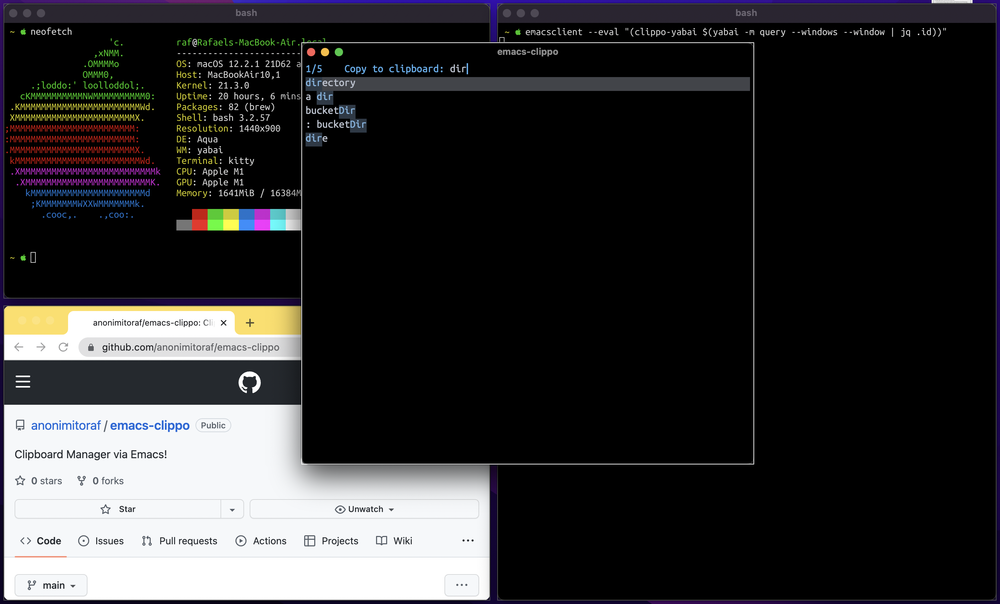
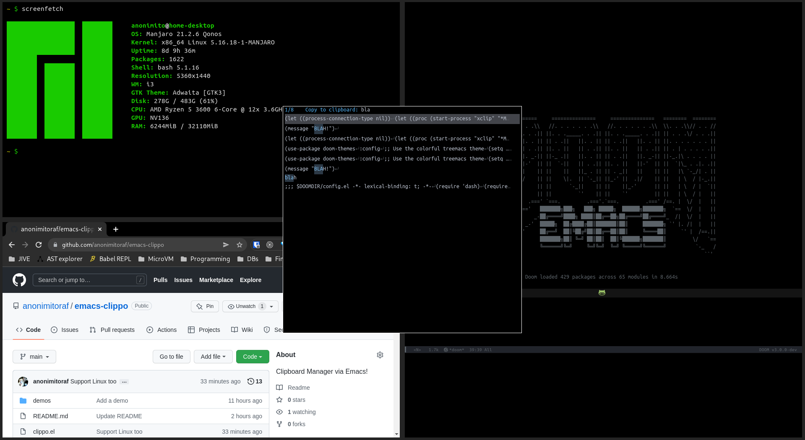

# Demos

## yabai (Mac)


## i3 (Linux)


BUT, it should just work for whichever window manager you use!

# Caveats

For now, only supported for Linux and Mac

# Installation
Not in MELPA (yet) but, all it you really need to do is evaluate `clippo.el` in your Emacs

# Quick Start

## Prerequisites
- emacs (with a daemon currently running)

## Mac

### Command
``` shell
emacsclient --eval "(clippo)"
```
(You might want to create a keybinding for this, e.g. via skhd)

### Extra Prerequisites (yabai)
- jq

### Extra Setup (yabai)
- Tell yabai to auto-focus emacs-clippo when it gets instantiated. Put this into your yabairc
```shell
yabai -m signal --add event=window_created title='^emacs-clippo.*' action='yabai -m window --focus ${YABAI_WINDOW_ID}'
```

- Tell yabai configure emacs-clippo to be a floating window. Put this into your yabairc
``` shell
yabai -m rule --add title='^emacs-clippo.*' layer=above manage=off
```

- If you didn't build Emacs with `--with-no-frame-refocus`, the command you want to invoke instead, is:
``` shell
emacsclient --eval "(clippo-yabai $(yabai -m query --windows --window | jq .id))"
```
We need to pass in the window ID, otherwise, OSX focuses Emacs GUI (from which emacsclient was spawned) after you copy to clipboard.
NOTE: This, for some reason, causes a 1-2 sec delay for emacsclient to close, so it's recommended that you build Emacs with `--with-no-frame-refocus` if possible!

# Linux

### Extra Prerequisites
- xclip

### Command
``` shell
emacsclient --eval "(clippo)"
```
(You might want to create a keybinding for this, e.g. in your i3 config)

### Extra Setup (i3)
- Tell i3 to configure emacs-clippo to be a floating window. Put this into your i3 config file

``` shell
for_window [title="^emacs-clippo.*" class="Emacs"] floating enable
```
